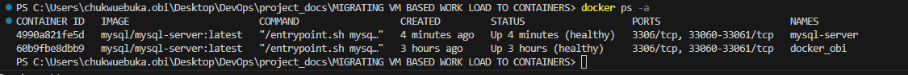
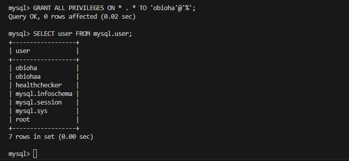
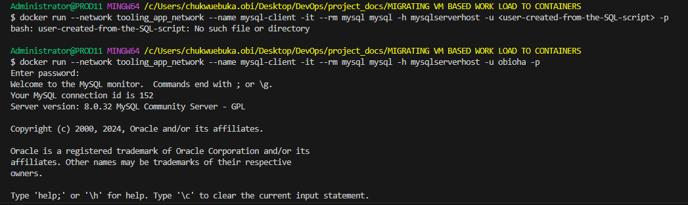
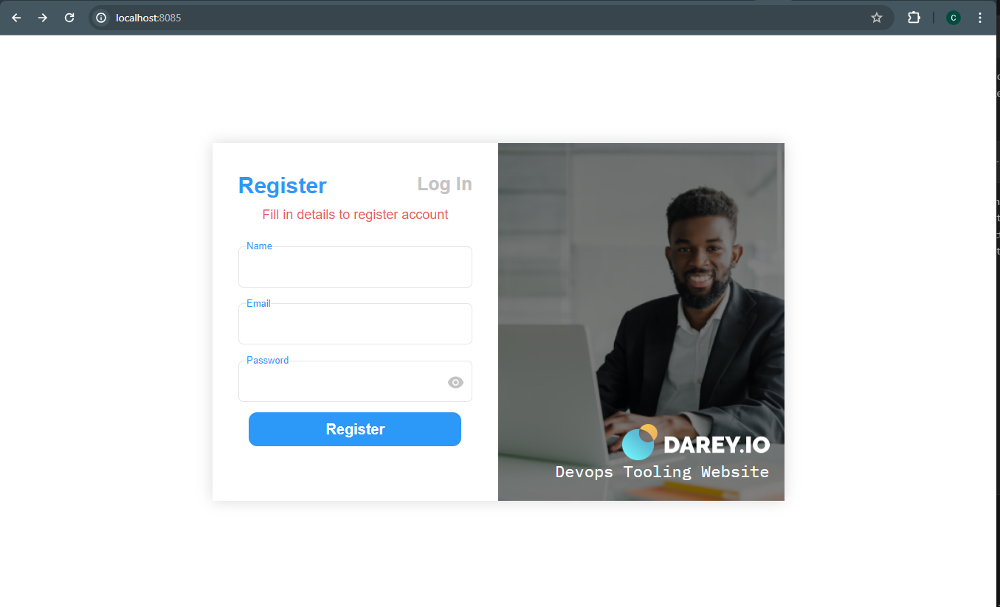
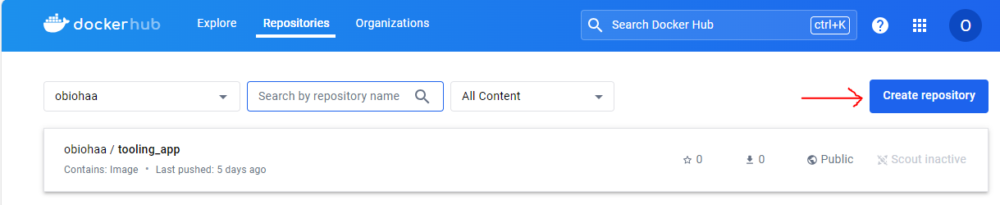

## MIGRATING VM BASED WORKLOAD TO CONTAINERS

In this project we will be looking at docker images and containers and how to move projects from virtual machines to containers.

Unlike VM, docker allocates not the whole guest OS for your application, but only isolated minimal part of it. This isolated container has all that your application needs and at the same time its lighter, faster and can be shipped as a docker image to multiple phisical and virtual environments as long as this environment can run docker image. This approach solves the popular environment incompatibility issue developers face with operations teams.

### container orchestration with Docker Compose

1. Pull MySQL Docker image from docker hub [Docker Hub Registry](https://hub.docker.com/). We start by pulling the appropriate [Docker image for MySQL](https://hub.docker.com/_/mysql). 

```
docker pull mysql/mysql-server:latest 
```
- To check list of the image run the below code 

```
docker image ls
```


2. Next we deploy the MySQL container to our docker engine.

- Run the below code

```
docker run --name <container_name> -e MYSQL_ROOT_PASSWORD=<my-secret-pw> -d mysql/mysql-server:latest
```
```
docker run --name docker_obi -e MYSQL_ROOT_PASSWORD=docker_docker_dockest -d mysql/mysql-server:latest
```

- Remember to replace "container_name" with your container name and "my-secret-pw" with your container mySQL root password.
- Then we check to see if the MySQL container is running.

```
docker ps -a
````


3. Connecting to the MySQL Docker container. We can either connect directly to the container running the MySQL server or use a second contianer as a MySQL client

- Approach 1, connecting directly to the container running MySQL server: Provide the root password when prompted


```
docker exec -it docker_obi mysql -uroot -p
```
and...

- Approach 2, we create a network:

```
docker network create --subnet=172.18.0.0/24 tooling_app_network 
```

Creating a custom network is not necessary because even if we do not create a network, docker will use the default network for all the containers we run. Here we will create a network with subnet dedicated for our project and use it for both MySL and the application so that they can connect.


Lets run the MySQL server container using the created network. First let us create an environmental variable to store the root password.

```
export MYSQL_PW=docker_docker_dockest
```

Run the below code

```
docker run --network tooling_app_network -h mysqlserverhost --name=mysql-server -e MYSQL_ROOT_PASSWORD=docker_docker_dockest  -d mysql/mysql-server:latest 
```

Flags.

- -d runs the container in detached mode
- --network connects a container to a network
- -h specifies a hostname

To verify the container is running we run the below code

```
docker ps -a
```




4. Let us ceate a fileand name it create_user.sql then add the below code to it. This will help us create a user as its not a good practice to use the root user.

```
CREATE USER '<user>'@'%' IDENTIFIED BY '<client-secret-password>';
GRANT ALL PRIVILEGES ON * . * TO '<user>'@'%';
```
Then un the below script

```
docker exec -i mysql-server mysql -uroot -p<password> < ./create_user.sql
```
NOTE: If the above code does not work for you due to windows or gives a "device input is not TTY", You can run the sql script in the container directly.

- first connect to the MySQL container

```
docker exec -it mysql-server mysql -uroot -pdocker_docker_dockest
```

- Then run the script line by line

```
CREATE USER 'obioha'@'%' IDENTIFIED BY 'mySQL_@passwood';
GRANT ALL PRIVILEGES ON * . * TO 'obioha'@'%';
```

- You can confirm if the user was created by running the below

```
SELECT user FROM mysql.user;
```



5. Connect to the MYSQL server from a second container running the MySQL client utility

Lets run the below code

```
docker run --network tooling_app_network --name mysql-client -it --rm mysql mysql -h mysqlserverhost -u <user-created-from-the-SQL-script> -p
```


FLAGS
- --name gives the container a name
- -it runs in interative mode and Allocate a pseudo-TTY
- --rm automatically removes the container when it exits
- --network connects a container to a network
- -h a MySQL flag specifying the MSQL server container hostname
- -u user created from the SQL script
- -p password specified for the user created from the SQL script

6. Next we prepare a database schema so that the tooling application can connect to it

    - Clone the tooling-app repository from [here](https://github.com/dareyio/tooling) or run ``` git clone https://github.com/darey-devops/tooling.git```

    - On our terminal we will export the location of the SQL file to a variable ``` export tooling_db_schema=~/tooling/html/tooling_db_schema.sql```

    - Use the SQL script to create the database and prepare the schema. With ```docker exec``` command, we can execute a command in a running container ```docker exec -i mysql-server mysql -uroot -p$MYSQL_PW < $tooling_db_schema``` Look out for the directory.

    - Update the ```db_conn.php``` file with connections details to the database
    
```
$servername = "mysqlserverhost"; // input servername
$username = "obioha"; // input username
$password = "mySQL_@passwood"; //input password
$dbname = "toolingdb"; // input dbname
```

7. Running the Tooling App: 

To containarize our application we will use a pre-created Dockerfile. It contains instuction that tells docker how to pack our application into a container.

To begin, ensure you are in the tooling directory where the Dockerfile is located. Run the below code

```
docker build -t tooling:0.0.1 .
```
The -t ensures we add a tag tooling:0.0.1, also notice the . at the end. This tells docker to locate the Dockerfile in the current directory you are running the command. Otherwise you would need to specify the absolute path to the Dockerfile . 

Lets run the tooling app using the code below

```
docker run --name=tooling_con --network tooling_app_network -p=8085:80 -itd tooling:0.0.1
```
We specified the ---network flag to put the container in the same network as the database so that the tooling and database can easily connect on the same virtual network. The -p flag is used to map the container port with the host port. Within the container, apache is the webserver running and by default it listens to port 80. This can be confirmed with the ```CMD ["START-APACHE"]``` section of the dockerfile. But we cannot directly use port 80 on our host machine because it is already used. The work around is to use another port that is not used by the host machine. In our case port 8085 is free, so we can map that to port 80 running in the container.



[Docker Glossary](https://docs.docker.com/glossary/#container)

In adddition to the project above we will do some practice task here, the task for the TODO app will be done in the TODO reprository.  

1. We will create a Docker Hub account [docker_hub](https://hub.docker.com/)

2. Create a new Docker Hub repository

3. Push the docker images from your PC to the repository

``` docker push obiohaa/tooling_app:latest ```




4a. Write a Jenkinsfile that will simulate a Docker Build and a Docker push to the registry.

4b. Connect your repo to jenkins

4c. create a multi-branch pipeline

4d. Simulate a CI pipeline from a feature and master branch using previously created Jenkinsfile

4e. Verify the images pushed from the CI can be found at the registry

